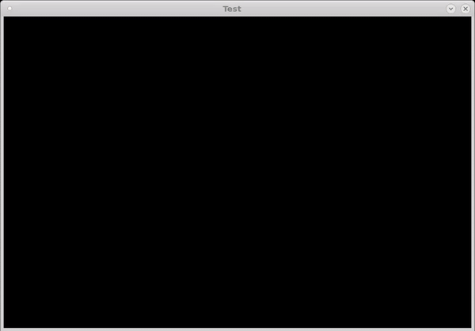

# Ubik
Path-tracer using embree / SDL / OpenEXR

# Examples

These examples are using a dummy integrator that opens a TIFF file from disk and "render" it.
Each time a pixel of the image is sampled, a random noise is added to the RGB value. Over time, the noise should be averaged out.

## Interactive Rendering

## Tiled rendering

# External Dependencies:
* OpenEXR (2.0+): openexr.com
* SDL (2.0+): https://www.libsdl.org
* TIFF (3.9+): https://www.adobe.io/open/standards/TIFF.html
* Embree (2.17+): https://www.embree.org

# Other Dependencies:
* getMemorySize by David Robert Nadeau (http://NadeauSoftware.com/)
* OptionbParser by Johannes Weifll (http://github.com/weisslj/cpp-optparse.git)
* ctpl by Vitaliy Vitsentiy (https://github.com/vit-vit/CTPL)

# References
* Test image "Kodak Image 21" from http://r0k.us/graphics/kodak/kodim21.html
