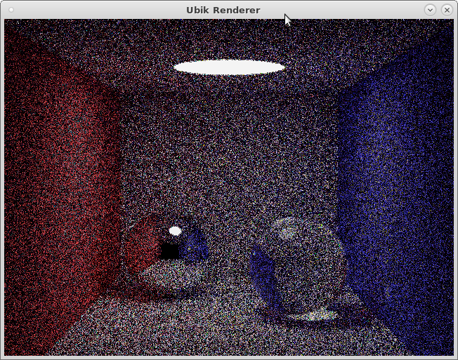

# Ubik
WIP C++ Path-tracer framework using SDL for interactivity / display.
Modular design to allow for experimentations, so it's easy to implement a new Sampler, Integrator or Renderer.

**Current status:**
* Renderer:
  * tiled rendering with several traversal algorightms
  * interactive rendering using the mouse and key modifiers
* Driver: 
  * display driver using SDL
  * output driver writing out OpenEXR files
* Sampler:
  * fixed sampling
  * adaptative sampling with threshold
* Integrator:
  * WIP embree path tracer
  * "smallpt" algorithm
  * dummy image render integrator to test the rest of the application (reads a TIFF file from disk and "renders" a noisy version of it, ie. each time a pixel of the image is sampled a random noise is added to the RGB value - the idea being that with enough samples the noise should be averaged out)

# Usage

You can specify the sampler, integrator and renderer by name on the command line.

```
ubik --renderer=tiled --sampler=fixed --samples=2 --integrator=smallpt --width=640 --height=480 --show-window
```

This will produce the following render:


# Examples

These examples are using the dummy image render integrator. They will be replaced by a proper 3d path render when it's implemented.

## Interactive Rendering


## Tiled rendering


# Installation

After cloning the main repository, you need to register and update the submodules:
```bash
git submodule init thirdparty/ctpl
git submodule init thirdparty/cpp-optparse
git submodule update
```

The project is built with cmake. Cmake will try to locate the following libraries: SDL2, Tiff, OpenEXR, Embree. If it doesn't find them, you will need to specify them using the syntax shown in the example below.

```bash
mkdir -p build
cd build
cmake .. \
    -DSDL2_INCLUDE_DIRS=/code/thirdparty/sdl2/2.0.9/include/SDL2/ \
    -DSDL2_LIBS=/code/thirdparty/sdl2/2.0.9/lib/gcc-6.3.0/libSDL2.so \
    -DTIFF_LIBRARY:FILEPATH=/code/thirdparty/tiff/4.0.4/lib/gcc-6.3.0/libtiff.so \
    -DTIFF_INCLUDE_DIR=/code/thirdparty/tiff/4.0.4/include/ \
    -DOPENEXR_INCLUDE_DIR=/code/thirdparty/openexr/2.2.0/include/ \
    -DOPENEXR_Half_LIBRARY:FILEPATH=/code/thirdparty/openexr/2.2.0/lib/gcc-6.3.0/libHalf.so \
    -DOPENEXR_IlmImf_LIBRARY:FILEPATH=/code/thirdparty/openexr/2.2.0/lib/gcc-6.3.0/libIlmImf.so \
    -DEMBREE_INCLUDE_DIR=/code/thirdparty/embree/3.5.2/include \
    -DEMBREE_LIBRARY=/code/thirdparty/embree/3.5.2/lib/gcc-6.3.0/libembree.so
make
```
Once built, the executable will be located in the project's *bin* folder. 

# External Dependencies:
* OpenEXR (2.0+): https://www.openexr.com/
* SDL (2.0+): https://www.libsdl.org
* TIFF (3.9+): https://www.adobe.io/open/standards/TIFF.html
* Embree (2.17+): https://www.embree.org

# Other Dependencies:
* getMemorySize.cpp by David Robert Nadeau (http://NadeauSoftware.com/) is provided under the Creative Commons Attribution 3.0 Unported License (http://creativecommons.org/licenses/by/3.0/deed.en_US)
* OptionbParser by Johannes Weißl (http://github.com/weisslj/cpp-optparse.git), added as a git submodule
* ctpl by Vitaliy Vitsentiy (https://github.com/vit-vit/CTPL), added as a git submodule

# References
* Test image "Kodak Image 21" from http://r0k.us/graphics/kodak/kodim21.html
* SmallPt integrator algorithm adapted from http://www.kevinbeason.com/smallpt/
